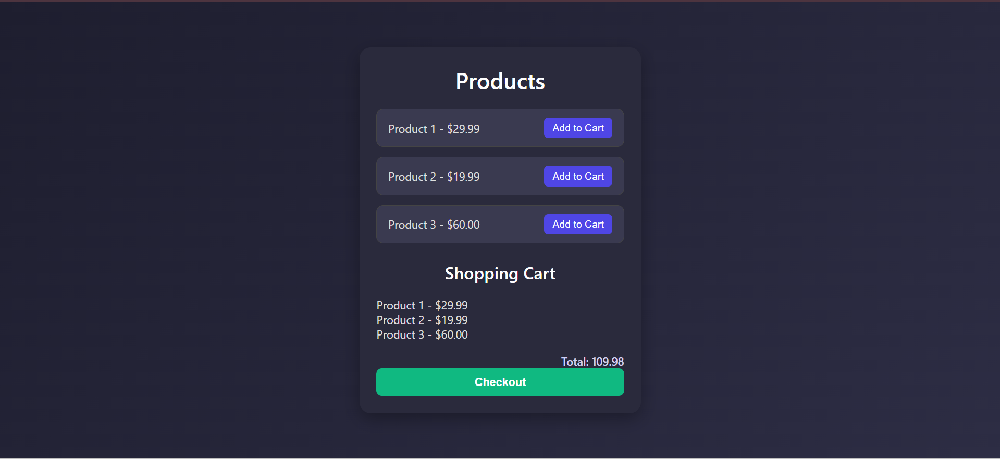

**Project Title**
Ecommerce Cart Page

**Description**
This project is a simple yet modern ecommerce cart interface built using HTML, CSS, and JavaScript. It allows users to browse products, add them to a cart, view selected items with prices, and proceed to checkout.

**Screenshot**

**Features**

* Dynamic cart updates as items are added
* Total price calculation in real time
* Minimal dark-themed design with smooth animations

**Tech Stack**

* HTML
* CSS
* JavaScript

**Purpose**
Built as a frontend practice project to strengthen skills in DOM manipulation, event handling, and dynamic user interface creation.

---

